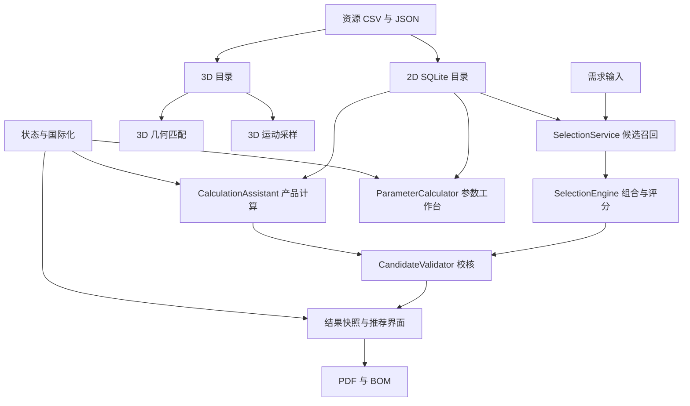

# VisionSelect 全项目模块审查

审查日期：2026-09-12。审查基准：`adcbc8014679c376216c56916a7e6a300060d546` 上的当前工作树，包含此前尚未提交的界面、导航和候选校核修复。本轮没有修改业务实现，也没有回退已有改动。

## 1. 结论与验证范围

当前项目已经具备较完整的选型工作流，但主要风险集中在**数据进入系统时丢失含义、预筛选漏掉可行组合、不同计算入口采用不同验收规则，以及交付工具没有随技术栈迁移**。继续微调页面比例不能解决这些问题，应先修复影响结论和用户数据的链路。

本次按职责划分为 12 个模块，记录 19 项问题：7 项 P1、12 项 P2。P1 表示应优先修复的结果错误、数据丢失或交付阻断；P2 表示需要安排修复的边界、状态、可追溯性和工程保障问题。静态确认的问题与实际复现的问题在下文分别标明，未验证的硬件行为不作为确定缺陷。

验证结果：

- 当前 MSVC Release 构建的 CTest：算法测试 39.03 秒，UI 测试 18.01 秒，两个测试程序均通过，总计 57.05 秒。这里的“两个”是测试程序数量，不是仅有两个测试用例。
- 额外执行两项导航与布局测试：通过；重新生成 1440×900、1080×700、中英文和紧凑布局截图。
- 当前目录下首次页面切换含事件处理约 10–55 毫秒，重复切换约 3–14 毫秒，参数工作台任务切换约 2–18 毫秒。需求页首次点击为 0 毫秒，因为它已在构造时创建。测量不包含后台选型完成时间，也不是屏幕呈现延迟的专业测量。
- 额外启用通常跳过的十万条目录性能门槛：首次选型 2387 毫秒，超过 2000 毫秒门槛；随后独立复测通过。首轮期间还有审查探针编译，故不能据此断言稳定超时。结论是需要在受控环境重复测量，并把性能门槛纳入持续集成。
- 使用链接当前 Release 库的隔离 C++ 探针复现算法、CSV、目录升级和语言切换问题。所有数据库修改均发生在 `QTemporaryDir`，未修改用户实际目录和授权状态。
- 授权检查仅核对代码、公钥长度及测试公钥是否与生产公钥相同；生产公钥为 2048 位，且与测试夹具不同。未操作真实许可证。

本轮未重新构建 MinGW/MSVC 的全部配置，未执行安装器，未验证真实相机、镜头和光源，未逐条回溯所有厂商数据表，也未重新进行 150% 缩放、屏幕阅读器或 PDF 页面渲染验收。下文保留这些验证边界。

## 2. 模块划分与依赖

源代码与头文件约 20,641 行、77 个文件。界面层约 10,178 行，目录仓储约 3,496 行，选型层约 2,849 行，3D 层约 1,506 行；其余为核心类型、授权、国际化、报告与入口。统计不包含测试、资源和工具脚本。

| 模块 | 主要入口 | 职责与依赖 | 审查判断 |
| --- | --- | --- | --- |
| M1 核心领域与单位 | `src/core/` | 需求、规格、状态、采样策略、像素格式、接口兼容性 | 公共类型已建立，但状态与数据来源仍不统一 |
| M2 2D 目录与持久化 | `src/catalog/` | CSV、SQLite、迁移、分页、增删改、候选查询 | 事务和查询基础较好；导入语义与内置升级存在高风险 |
| M3 2D 选型与评分 | `SelectionService`、`SelectionEngine` | 召回、组合校核、光源匹配、排序 | 上游截断仍可丢失唯一解，部分风险没有进入状态体系 |
| M4 参数工作台与估算 | `ParameterCalculator`、`CalculationAssistant` | 正反算、候选估算、景深/曝光/传输校核 | 基础公式有较好边界处理，跨入口契约需统一 |
| M5 3D 目录与几何匹配 | `ThreeDCameraRepository`、`ThreeDCameraMatcher` | JSON 目录、用户覆盖、需求分类 | 原子写入较好，工作距离与视野没有联合校核 |
| M6 3D 运动与采样 | `ThreeDCalculation` | 触发、轮廓数、编码器、曝光周期、轴速 | 明确不支持的触发方式仍返回有效，离散计数有误 |
| M7 主界面与结果交互 | `MainWindow`、各页面 | 导航、异步计算、列表、详情、需求快照 | 日常导航明显改善，错误反馈和恢复方式仍可加强 |
| M8 状态、主题与国际化 | `UiSettings`、`UiThemeManager`、`LanguageManager` | 持久化、密度、对比度、中英文 | 新旧状态机制并存，结果诊断会中英混用 |
| M9 目录生产与溯源 | `tools/update_public_product_catalog.ps1`、资源数据 | 厂商数据提取、规格标准化、资源更新 | 估计值、实测值、公开值没有充分区分 |
| M10 报告与 BOM | `PdfReportWriter`、`MainWindow::exportBomCsv` | 方案导出、采购清单、工程复核 | 与界面状态契约不完整一致，写入失败反馈不足 |
| M11 授权 | `src/license/`、许可证生成器 | 签名、机器绑定、有效期、本地时钟记录 | 非对称验签成立；运行期检查和离线时钟边界需明确 |
| M12 构建、安装与测试 | CMake、PowerShell、Inno Setup、CTest、CI | 编译、部署、安装、质量门槛 | CMake 已迁移，旧打包链和翻译生成链未闭合 |

这里需要统一的是校核契约与数据含义，不宜把所有算法简单合并为一个巨大函数。2D 推荐、参数工作台和 3D 模型具有不同输入与适用范围，应共享明确的值、单位、来源和状态协议。

## 3. 优先级总表

| 编号 | 级别 | 模块 | 问题 | 证据 |
| --- | --- | --- | --- | --- |
| R01 | P1 | M2/M3 | 组合校核之前的 300 台相机上限漏掉唯一可行组合 | 隔离复现 |
| R02 | P1 | M1/M2/M9 | CSV 标准化丢失显式像素格式，改变载荷估算 | 隔离复现 |
| R03 | P1 | M5 | 3D 视野与工作距离分别判定，参考距离被扩展为自定容差 | 隔离复现 |
| R04 | P1 | M6 | 不支持外触发/编码器的相机仍返回有效采样结果 | 隔离复现 |
| R05 | P1 | M2 | 同名内置产品的参数修正不会更新已有数据库 | 隔离模拟旧版本复现 |
| R06 | P1 | M2/M7 | “导入 CSV”无替换预览，实际删除该类产品全部旧行 | 隔离复现及 UI 调用核对 |
| R07 | P1 | M12 | Qt 5 打包脚本和安装器路径与 Qt 6/CMake 产物不兼容 | 静态确认，旧目标不存在 |
| R08 | P2 | M3/M4 | 景深验收系数与适用条件在不同入口不一致 | 隔离复现 |
| R09 | P2 | M3 | 负畸变被当成零畸变 | 隔离复现及光学资料核对 |
| R10 | P2 | M3/M7 | 光源覆盖不足只进入推荐理由，没有进入风险栏 | 隔离复现 |
| R11 | P2 | M1 | 百万像素计算发生 32 位乘法溢出 | 隔离复现 |
| R12 | P2 | M6 | 轮廓数量用连续除法，UI 四舍五入可能少采样 | 隔离复现 |
| R13 | P2 | M9/M1 | 带宽等经验值没有来源属性，进入校核时被当作普通规格 | 数据统计与静态确认 |
| R14 | P2 | M8 | 已有结果切换语言后诊断中英混杂、同一风险重复 | 隔离复现 |
| R15 | P2 | M7 | 产品计算助手忽略目录查询错误并缓存空结果 | 静态确认 |
| R16 | P2 | M10 | PDF/BOM 对方案状态、完整型号和未知值的表达不足 | 静态确认，未做 PDF 视觉验收 |
| R17 | P2 | M10 | 导出打开成功后不充分检查写入/结束失败 | 静态确认，未注入磁盘故障 |
| R18 | P2 | M8/M12 | CMake 不生成翻译文件，修改 TS 后正常构建仍可使用旧 QM | 静态确认 |
| R19 | P2 | M12 | CI 未启用大目录性能门槛，也未覆盖安装与主要发布配置 | 配置核对及额外性能测试 |

## 4. 分模块深入分析

### M1：核心类型、单位与状态

已有较好的基础：`SamplingPolicy` 将最小特征采样与测量容差预算分开；`PixelFormat` 能区分打包格式和按字节占位的格式，并按行取整；`CandidateChecks` 已区分通过、未知和失败。接口兼容判断偏保守，没有把不同螺距直接当成相同接口。

**R02：颜色类型与传输格式共用字段。** `CameraSpec::colorMode` 同时承载 `Mono/Color` 和 `Mono12/BayerRG12p`。CSV 入口的 `normalizeCameraColorMode()` 只要包含 `mono` 就返回 `Mono`，`loadCameraRows()` 无条件使用该归一化结果。一个原本明确的格式变成未知，后续退回位深估算。2000×2000、`Mono12` 样例在导入前单帧为 8 MB，导入后字段变成 `Mono`，单帧估算变成 6 MB，低估 25%。当前校核会把格式标为待确认，因此不应把这一复现描述为界面完全无警告，但数值信息确实被破坏。

位置：[CatalogRepository.cpp:2952](D:/code/VisionSelect/src/catalog/CatalogRepository.cpp:2952)、[CatalogRepository.cpp:3189](D:/code/VisionSelect/src/catalog/CatalogRepository.cpp:3189)、[SelectionEngine.cpp:480](D:/code/VisionSelect/src/selection/SelectionEngine.cpp:480)。应拆分颜色类型、可选传输格式、当前选定格式和 ADC 位深；CSV、SQLite、编辑器、选型和报告必须能无损往返这些字段。补充 `Mono8/Mono12/Mono12p/Bayer/RGB` 的导入导出与载荷联动测试。

**R11：像素乘法先溢出再转浮点。** `CameraSpec::megapixels()` 执行 `resolutionX * resolutionY / 1000000.0`，前面的乘法仍为 `int`。UI 允许两个维度分别到 200000；探针输入 100000×100000，得到 1410.065408 MP，而应为 10000 MP。带宽函数已经先转为 `double`，但这个公共函数没有同样处理。位置：[SelectionTypes.cpp:102](D:/code/VisionSelect/src/core/SelectionTypes.cpp:102)。应在乘法前提升类型，并统一各入口的尺寸上限；回归测试同时验证 MP、排序、报告和载荷，不能只测带宽不溢出。

进一步的结构问题：2D 目录大量用 `0` 代表未公开，3D 用 `-1`，工作台用 `optional<double>`；公共状态还有不同的枚举取值顺序。它们目前通过人工适配，长期容易把未知当成零或错误比较枚举。建议形成显式 `已知值 + 单位 + 来源 + 适用条件` 的领域对象，逐步迁移，而非一次重写全部页面。

### M2：2D 目录、SQLite 与 CSV

查询使用参数绑定和排序列白名单，分页有稳定的附加排序；CSV 支持带引号的跨行字段；整类导入有事务；初始化追加内置行也有事务。这些机制应保留，不能将本次问题误判为 SQL 注入或所有导入都不原子。

**R05：内置更新只插入缺行，不更新同名规格。** `appendMissingBuiltInRows()` 对内置产品调用 `insert...(..., false, ...)`，底层为 `INSERT OR IGNORE`，`source_version` 又固定为 `1`。新版本即使修正了同厂家同型号的 fps、景深、像圈等，旧用户数据库仍保留原值。探针将隔离数据库某内置相机 fps 模拟为旧值 0.12345，而当前资源为 120；再次初始化后仍为 0.12345。位置：[CatalogRepository.cpp:829](D:/code/VisionSelect/src/catalog/CatalogRepository.cpp:829)、[CatalogRepository.cpp:1080](D:/code/VisionSelect/src/catalog/CatalogRepository.cpp:1080)。应对未被用户覆盖的内置行按资源版本或内容摘要更新；用户修改用独立覆盖层或明确标志保留。测试应同时覆盖“内置修正生效”和“本地修改不被覆盖”。

**R06：导入实际是替换整类目录。** `loadCameraCsv()` 进入 `replaceCamerasInDatabase()` 后先执行 `DELETE FROM camera_products`；镜头和光源相同。`MainWindow::importCameras()` 只选择文件就执行，缺少追加/更新/整库替换的选择、影响数量和备份提示。隔离数据库 301 台相机导入一行 CSV 后只剩 1 台。事务保证这个删除完整提交，不能保护用户不受误解“导入”含义的影响。下次初始化可能补回内置产品，但被替换的自定义产品无法因此恢复。

位置：[CatalogRepository.cpp:1209](D:/code/VisionSelect/src/catalog/CatalogRepository.cpp:1209)、[CatalogRepository.cpp:1404](D:/code/VisionSelect/src/catalog/CatalogRepository.cpp:1404)、[MainWindow.cpp:1392](D:/code/VisionSelect/src/ui/MainWindow.cpp:1392)。建议默认按厂家+型号合并，整库替换成为明确选项；在提交前展示新增、修改、冲突、删除数量，保存可恢复备份。补测用户自定义数据、重复型号、坏行、取消操作和回滚。

目录升级还缺少明确的前向版本拒绝和增量迁移框架；现有 `user_version=1` 足够支持当前结构，但下一次加字段时应先设计迁移，不宜继续只依赖 `CREATE TABLE IF NOT EXISTS`。这是演进建议，未声称当前存在已发生的升级损坏。

### M3：2D 召回、组合、评分与光源

**R01：相机召回上限在组合可行性之前生效。** `SelectionService` 固定取 300 台相机、500 个镜头、300 个光源。相机 SQL 按分辨率、fps、厂家和型号排序，尚未考虑镜头接口、倍率与像圈。301 台满足分辨率和帧率的相机中，将前 300 台设为 F 接口、最后一台设为 C 接口，目录只提供 C 镜头：服务返回 20 个不满足方案；把最后一台直接交给 `SelectionEngine` 则存在通过硬条件的方案。

位置：[SelectionService.cpp:21](D:/code/VisionSelect/src/selection/SelectionService.cpp:21)、[CatalogRepository.cpp:2422](D:/code/VisionSelect/src/catalog/CatalogRepository.cpp:2422)。此前移除引擎内部 96 台截断是正确修复，但不足以保证上游召回。建议按兼容接口、传感器尺寸和几何区间建立可行性分组，分批读取并在无可行解时扩展召回；若保留预算限制，应显示已搜索范围和未穷举状态。测试必须从真实仓储和 `SelectionService` 入口执行，而非只向引擎传入完整数组。

**R09：负畸变被忽略。** `distortionErrorUm()` 对 `distortionPercent <= 0` 直接返回 0。CSV 和公开结构可传入负值；输入 -2%、100 mm FOV 时得到 0 μm。光学畸变允许有正负号，负值不是“没有畸变”；这里应保存符号用于类型/曲线说明，用绝对量评估误差风险，并与未知值区分。仅按照本项目现有线性粗估口径，幅值应非零；本审查并未认定该粗估能替代畸变曲线或标定。位置：[SelectionEngine.cpp:541](D:/code/VisionSelect/src/selection/SelectionEngine.cpp:541)。光学依据：[Edmund Optics 畸变说明](https://www.edmundoptics.com/knowledge-center/application-notes/imaging/distortion/)。补测正值、负值、已知零、未知和 CSV 往返。

**R10：光源风险没有进入风险集合。** `scoreLight()` 在覆盖不足时扣分，但把文字追加到 `reasons`，之后并入 `score.reasons`；`CandidateChecks` 没有光源覆盖项，风险栏只读取失败、未知和 `score.risks`。1×1 mm 光源对 10×10 mm 需求的探针结果为覆盖 -90%、`hardConstraintsPassed=true`，覆盖不足只出现在理由中，没有进入风险列表。位置：[SelectionEngine.cpp:695](D:/code/VisionSelect/src/selection/SelectionEngine.cpp:695)、[SelectionEngine.cpp:605](D:/code/VisionSelect/src/selection/SelectionEngine.cpp:605)。至少应将覆盖不足、频闪待确认等明确归入风险；哪些能成为硬约束，需要结合背光、环光、条光的不同照明模型，不能将发光面的物理尺寸一律等同于照明视野。

评分目前是规则加减分，且为普通镜头保留候选配额。它可以表达经验偏好，但不是成功概率、成本最优解或经标定的质量分数。当前 UI 已注明相对分只用于本批候选，这一点应保留；后续应公开分项与配额策略，明确测量精度、标称镜头 MP 和物方采样之间的不同含义。

### M4：参数工作台与产品计算助手算法

`ParameterCalculator` 的长处是显式空值、有限数值校验、双轴 FOV、像素格式打包、ROI 和传输/存储格式分离；薄透镜物距与机械工作距离也有提示。独立 A/B 快照和实测视场失效标记已建立，不应回退成所有页面共享一个可变需求对象。

**R08：相同景深输入有不同验收结论。** 推荐与镜头助手通过 `CandidateValidator` 要求 DOF ≥ 高度波动×1.5；工作台在确认适用条件后直接要求 DOF ≥ 峰峰值高度。高度 1 mm、DOF 1.2 mm 的探针结果为推荐“失败”、工作台“通过”。这属于隐含安全系数和验收策略不一致，不是证明 1.5 或 1.0 哪个数学上必然错误。

位置：[CandidateValidator.cpp:53](D:/code/VisionSelect/src/selection/CandidateValidator.cpp:53)、[ParameterCalculator.cpp:390](D:/code/VisionSelect/src/selection/ParameterCalculator.cpp:390)。此外，推荐流程会直接采用目录 DOF，或用像元两倍作为弥散圈粗估；工作台却要求用户确认 DOF 条件。景深与光圈、倍率和可接受清晰度有关，不能只靠一个无条件标量互通。[Edmund Optics 景深与分辨率说明](https://www.edmundoptics.com/knowledge-center/video/eo-imaging-lab/eo-imaging-lab-depth-of-field-in-depth/)

建议把高度定义、安全系数、光圈、倍率、评价标准及数据来源放入校核输入；在界面分别展示物理覆盖与工程余量。在条件未确认时保持待确认。增加跨三个入口的契约测试，允许有明确标识的策略差异，禁止无提示地给出相反结论。

还需关注：同一系统内旧 `CalculationAssistant::calculate()`、镜头估算与新工作台仍保留平行逻辑；当前界面主要使用后两者，未将旧接口所有行为判成用户可触发缺陷。建议先梳理调用方与稳定 API，再淘汰重复实现。

### M5：3D 目录与需求匹配

3D 自定义文件使用 `QSaveFile`，保存失败会恢复内存快照；坏 JSON 有隔离处理；用户层可以覆盖同身份内置型号。这些措施比直接写入整份 JSON 稳健。

**R03：视野与距离没有联合可行性。** Matcher 对 X/Y 分别取近端、参考、远端视野的最大值，再独立判断工作距离范围。工作范围 100–200 mm、近端 X FOV 100 mm、远端 200 mm，要求在 100 mm 距离覆盖 180 mm 时，代码仍返回“满足”。它实际上使用了另一个距离处的视野。

只有参考距离、没有范围时，还自行取 `max(5 mm, reference×15%)` 当允许偏差；参考距离 100 mm、要求 110 mm，也返回满足。参考点并不自动证明这个工作区间。位置：[ThreeDCameraMatcher.cpp:150](D:/code/VisionSelect/src/three_d/ThreeDCameraMatcher.cpp:150)、[ThreeDCameraMatcher.cpp:163](D:/code/VisionSelect/src/three_d/ThreeDCameraMatcher.cpp:163)。应按厂家给定的几何模型/条件表判断同一距离下的 FOV 和 Z 范围；允许插值的型号才使用明确插值规则。缺乏适用条件时为待确认，不能凭经验生成“已确认工作范围”。

该模块还把点频、轮廓频率、帧率以 `max(scanRateMaxHz, frameRateHz)` 汇合；各种技术路线的数据产物与限制不同。当前是否实际高估某一型号，需要结合具体规格验证，列为建模风险，不作为已复现型号错误。品牌优先顺序也是内置偏好，并非按余量或适用性评分，应在产品层明确说明。

### M6：3D 运动、触发与采样

**R04：不支持的触发方式没有进入不可行状态。** 外触发不支持只追加风险；编码器路径根本没有检查 `supportsEncoder`。最终不可行状态仅由速率、曝光等布尔值决定。两个探针均将支持标志设为 0，结果仍 `valid=true`、`status=Warning`。界面实际显示“需要确认”，不是绿色“参数正常”；但对已知不支持的硬件，应显示“参数不可行”，并停止输出可以直接采用的配置结论。

位置：[ThreeDCalculation.cpp:144](D:/code/VisionSelect/src/three_d/ThreeDCalculation.cpp:144)、[ThreeDCalculation.cpp:175](D:/code/VisionSelect/src/three_d/ThreeDCalculation.cpp:175)、[ThreeDCalculation.cpp:258](D:/code/VisionSelect/src/three_d/ThreeDCalculation.cpp:258)。统一触发能力三态：支持才继续、不支持直接不可行、未公开保持待确认；与 Matcher 中编码器硬拒绝规则保持一致。补测三种模式×三种支持状态，不能只测频率超过上限。

**R12：轮廓数量不是离散采集数量。** `profileCount = distance / interval` 返回浮点；UI 用零位小数格式化。1 mm、0.3 mm 得到 3.3333，显示为 3。如果需求是覆盖整段距离，这不能作为足够的采样配置。位置：[ThreeDCalculation.cpp:83](D:/code/VisionSelect/src/three_d/ThreeDCalculation.cpp:83)、[ThreeDCameraPage.cpp:1186](D:/code/VisionSelect/src/ui/pages/ThreeDCameraPage.cpp:1186)。应先定义起止点是否都采、距离指跨度还是采样单元长度，再使用整数数量和覆盖余量。闭区间点采样与连续条带覆盖的计数可能不同，不宜无条件只改成 `ceil()` 后宣布完成。

模型还需区分连续扫描和面阵快照，曝光/读出是否可重叠、编码器倍频/分频的语义也要绑定设备条件。当前 `readoutTimeUs`、扫描率和帧率等数据缺失时，应保持条件明确的估算。

### M7：主界面、交互与异步任务

本轮真实 QWidget 截图显示，产品计算和推荐页以主表为主体，3D 筛选已折叠为按钮，1080×700 时分别可见约 7–9 行，明显优于用户最初截图中的约三行。主导航可复用页面，旧的重复构造和挂载开销已得到控制。

导航、布局、文字适配与视觉检查记录：

- 六个主页面均经过宽窗/窄窗截图；检查了输入按钮位置、主表、滚动区域和折叠导航。
- 中英文切换和紧凑密度测试通过；长型号仍需要横向滚动或详情。建议允许冻结状态与型号列，避免横向查看规格时丢失产品身份。
- 结果详情默认折叠，使主表获得空间；缺点是多条失败原因在底部摘要中仍较密集，可增加“仅看待确认/失败项”的明确筛选。
- 3D 无筛选条件时显示“267 个满足需求”，容易把未校核条件的全量目录误读为已完成评估。建议改为“全部型号，尚未设定需求”，有约束后再统计满足状态。
- 本轮进行了生成截图的人工视觉查看，未进行真实设备上的逐项手工操作验收，也未重验 150% 缩放和屏幕阅读器。

**R15：助手查询失败被显示成无候选且被缓存。** `refreshCalculationAssistant()` 在查询前设置 `m_assistantRequest`，调用两个仓储查询时没有传入错误输出。数据库暂时不可读或查询失败时，用户看到空候选，随后相同需求导航直接命中缓存，不再重试。位置：[MainWindow.cpp:1303](D:/code/VisionSelect/src/ui/MainWindow.cpp:1303)。应收集错误、显示可重试状态，仅在查询成功后提交缓存；缓存键还应包含目录版本。测试覆盖查询失败、重试成功和空目录三种不同状态。

首次打开助手、首次加载目录与批量导入仍在 UI 线程同步执行。当前内置数据下实测较快，不能据此声称现有导航仍普遍严重卡顿；大目录和慢磁盘下则应测量阻塞时间，再决定哪些操作转入工作线程。后台推荐本身已经使用 `QtConcurrent`，后续优化应避免破坏需求快照和最终结果一致性。

### M8：持久化、主题与国际化

工作台状态采用稳定字段键和 JSON 版本，窗口、表头、分隔器与密度各有持久化入口；高对比模式读取 Qt 的系统对比度偏好。语言字符串读取有读写锁，未将其误报成已经确认的数据竞争。

**R14：已有诊断是本地化成品字符串。** 引擎将中文诊断存入 `hardFailures/score.risks`；切换语言后界面又动态生成英文 `CandidateCheck` 消息，再合并原始中文字符串。探针同一条接口失败同时出现 `Camera / lens mount: Failed`、中文接口失败及其他中文风险，按字符串去重无法消除同一语义的重复。位置：[ResultPresentation.cpp:36](D:/code/VisionSelect/src/ui/ResultPresentation.cpp:36)、[SelectionEngine.cpp:615](D:/code/VisionSelect/src/selection/SelectionEngine.cpp:615)、[MainWindow.cpp:973](D:/code/VisionSelect/src/ui/MainWindow.cpp:973)。应保存诊断代码、参数和严重程度，在展示/导出时本地化；不应为换语言重新运行可能已变更的目录查询。补测保持原始数值快照同时完整转换全部诊断文本。

旧 `PageUiState` 依赖 `findChildren` 的创建顺序、选项索引和表格行号恢复；它不能可靠表达产品身份、列排序和所有折叠按钮状态。新工作台已有稳定键方案，建议逐页替换旧机制。此处是恢复契约风险，未在本轮声称已经复现错选另一型号。

### M9：目录生产、规格来源与数据质量

本轮资源统计为相机 1393、镜头 1004、光源 2180、3D 相机 267。相机中 733 条为 `Mono`、649 条为 `Color`、8 条空颜色、3 条近红外描述，**1393 条均没有明确传输格式**。247 条镜头无正值 DOF，24 条无正值最小/标称 WD；267 条 3D 记录均未给出外触发支持字段，49 条未给出编码器支持字段。这些是资源缺项统计，不等于产品不支持相应功能。

**R13：经验值没有携带来源属性。** 更新脚本根据接口名称生成固定带宽，例如 GigE 为 120 MB/s、USB 为 380 MB/s、CXP 为某固定容量；未知接口还退回 120。引擎对没有目录带宽的接口又使用另一组默认值，例如 GigE 110 MB/s，CXP 1250 MB/s。同一字段混合“接口经验容量”和“具体产品实测/公布容量”，校核结果无法解释输入依据。

位置：[update_public_product_catalog.ps1:94](D:/code/VisionSelect/tools/update_public_product_catalog.ps1:94)、[update_public_product_catalog.ps1:375](D:/code/VisionSelect/tools/update_public_product_catalog.ps1:375)、[SelectionEngine.cpp:498](D:/code/VisionSelect/src/selection/SelectionEngine.cpp:498)。建议分别存储标称链路速率、链路数量、有效载荷容量、估算开销、来源 URL、来源日期、原始文本和解析版本；缺少规格时不要写入看起来已确认的数值。接口代际和并行链路不能仅靠一个文字标签恢复。

脚本 `Add-ToMap()` 只以型号为键，而 SQLite 以厂家+型号为键；当前资源没有同名跨厂商冲突，但以后会产生覆盖风险。传感器与数值解析使用多条正则和经验默认，也需要固定原文夹具测试。应先产出待审变更和缺项差异，再生成正式资源，并与 R05 的目录版本升级配套。

### M10：PDF 与 BOM

此前“使用当前编辑中的需求导出旧结果”的问题已经通过结果快照修复，本轮没有重新把它列为缺陷。

**R16：导出没有完整承接界面的校核信息。** PDF 总览表没有逐方案的结构化状态，只有首选方案详情明确输出适配状态；多个字段主动 `.left()` 截断，表格与键值行固定高度且不换行，长型号/完整组合难以可靠读取。BOM 没有独立的 `status`、失败代码、未知代码和需求快照字段，只把综合风险放在光源行备注。把 BOM 按相机类别过滤后，容易丢失该方案的失败背景。未知 DOF 等数值在若干导出字符串中还会以 `0.00` 出现。

位置：[PdfReportWriter.cpp:62](D:/code/VisionSelect/src/report/PdfReportWriter.cpp:62)、[PdfReportWriter.cpp:93](D:/code/VisionSelect/src/report/PdfReportWriter.cpp:93)、[PdfReportWriter.cpp:244](D:/code/VisionSelect/src/report/PdfReportWriter.cpp:244)、[MainWindow.cpp:1808](D:/code/VisionSelect/src/ui/MainWindow.cpp:1808)。应逐行输出方案状态，保留完整厂家+型号，将未知显示为未知；PDF 使用可换行、可分页的行和重复表头；BOM 加入稳定方案 ID、状态和完整校核字段。测试必须检查内容和最终渲染，而非仅确认文件非空。

校正一项初步怀疑：实际 QPdfWriter 在本机的内容宽度为 671，表格列宽和为 670，没有证据支持“总列宽超过页面”。本次确认的是单元格截断策略、状态表达和分页风险，不是总宽度溢出。未进行 PDF 页面视觉验收。

**R17：写入结束错误可能被误报为成功。** BOM 只检查 `QFile::open()`，写完直接关闭并弹成功；PDF 未检查 `newPage()`、`painter.end()` 的返回结果。磁盘写入中途失败时，打开成功不代表文件完整。位置：[MainWindow.cpp:1800](D:/code/VisionSelect/src/ui/MainWindow.cpp:1800)、[MainWindow.cpp:1840](D:/code/VisionSelect/src/ui/MainWindow.cpp:1840)、[PdfReportWriter.cpp:123](D:/code/VisionSelect/src/report/PdfReportWriter.cpp:123)、[PdfReportWriter.cpp:333](D:/code/VisionSelect/src/report/PdfReportWriter.cpp:333)。建议临时文件/原子提交，检查流、写入、提交与结束状态；注入中途写失败，验证失败提示并保留原文件。本轮没有故意填满磁盘验证。

报告应增加实际产品资料来源与目录版本，当前引用几家机构名称不足以复现某个型号的具体判定。报告层依赖 `UiHelpers` 也使非界面导出依赖 Widgets/SVG，宜抽取纯展示/本地化对象供 UI 和报告共同使用。

### M11：授权与许可证工具

已核对的控制包括 RSA-SHA256 验签、产品标识、机器码、签发/到期日期和本地日期回退检测；本地时钟记录使用 DPAPI。生产公钥为 2048 位，与公开测试夹具的公钥不同，不能把测试私钥的存在误报为生产密钥泄漏。客户产物中有许可证生成工具，也不等于客户具有生产私钥。

需明确的产品与工程边界：

- 授权检查集中于启动和用户打开授权信息，没有运行中的定时到期检查。若合同要求到期当天停止长时间运行的会话，需要补充运行期策略；若只要求启动时验证，应明确这种语义。
- 本地 DPAPI 记录不是可信外部时间源；状态缺失/修复路径不能提供独立的防回滚时间保证。若产品需要更强保证，可采用签名离线续期凭据或受控在线校时。本轮未进行绕过操作。
- `LicenseIssuer` 接受的模数最小长度低于当前生产密钥长度，应限制新签发密钥的最低强度，并将测试专用入口与发布接口隔离。这是加固建议，不代表当前生产使用了弱密钥。
- 生成器与客户程序的打包、运维文档和私钥管理应分开，避免维护人员混淆客户安装包与内部签发工具。

位置：[main.cpp:24](D:/code/VisionSelect/src/main.cpp:24)、[LicenseManager.cpp:190](D:/code/VisionSelect/src/license/LicenseManager.cpp:190)、[LicenseManager.cpp:285](D:/code/VisionSelect/src/license/LicenseManager.cpp:285)、[LicenseIssuer.cpp:147](D:/code/VisionSelect/src/license/LicenseIssuer.cpp:147)。此模块没有发现并验证可直接伪造生产签名的缺陷，上述边界不计入 19 项确定问题的数量。

### M12：构建、安装、翻译和质量保障

**R07：交付脚本未完成 Qt 6 迁移。** `package_windows.ps1` 默认 Qt 5.12.9/MSVC2015，读取根目录 `bin/VisionSelect.exe`，并调用已经不存在的 `build_msvc2015.bat`。许可证打包脚本仍使用不存在的 `.pro` 和旧 `LicenseKeyGenerator.exe` 名称。当前 CMake 安装到 `dist/VisionSelect/bin/`，Inno Setup 却把快捷方式、卸载图标和安装后运行指向 `{app}/VisionSelect.exe`。安装器版本仍为 1.0.0，CMake 项目为 2.0.0。

位置：[package_windows.ps1:1](D:/code/VisionSelect/tools/package_windows.ps1:1)、[package_license_generator.ps1:21](D:/code/VisionSelect/tools/package_license_generator.ps1:21)、[CMakeLists.txt:212](D:/code/VisionSelect/CMakeLists.txt:212)、[VisionSelect.iss:34](D:/code/VisionSelect/installer/VisionSelect.iss:34)。这不意味着 README 中的 `build.ps1 -Install` 完全不能生成发布目录；失效的是仍留在项目中的旧打包入口与安装器衔接。应统一通过 CMake install/受支持部署生成目录，再由安装器包装；版本只保留一个来源，增加干净机器安装、启动、卸载验收。

**R18：翻译二进制没有构建依赖。** CMake 将已经存在的两个 `.qm` 作为资源，没有从 `.ts` 到 `.qm` 的 `lrelease` 构建步骤。开发者修改 TS 后执行正常构建，可能仍打包旧翻译。位置：[CMakeLists.txt:28](D:/code/VisionSelect/CMakeLists.txt:28)。应把 Qt LinguistTools 和翻译生成加入构建图，测试改动一个翻译条目后增量构建能生效；旧打包脚本中的独立 lrelease 不能代替受支持的 CMake 流程。

**R19：测试通过尚不能覆盖当前发布风险。** CI 仅运行 MSVC Debug 和常规 CTest。十万条性能用例必须设置 `VISIONSELECT_PERF_GATE=1` 才会执行，默认跳过；其辅助脚本还指向旧根目录 bin 和 Qt 5。导航测试只输出时间，没有性能断言。没有 Release/MinGW、安装器、翻译生成、PDF 渲染的 CI 验收。

位置：[windows.yml](D:/code/VisionSelect/.github/workflows/windows.yml)、[test_selection.cpp:1639](D:/code/VisionSelect/tests/test_selection.cpp:1639)、[test_ui.cpp:758](D:/code/VisionSelect/tests/test_ui.cpp:758)、[run_catalog_performance_gate.ps1:1](D:/code/VisionSelect/tools/run_catalog_performance_gate.ps1:1)。建议在固定环境记录多次测量和分位数，区分首次构造、导航、SQL 召回、组合评分、渲染、导入；同时把 R01–R06 的跨模块回归放进常规流水线。性能优化必须和召回正确性一起验收，不能通过继续裁掉候选来满足时间门槛。

## 5. 架构与设计改进顺序

### 第一阶段：修复结论与用户数据

1. 先将隔离复现转换为正式回归：CSV 单行导入影响范围、内置同名升级、格式无损往返、301 台唯一兼容相机、3D 同距离 FOV、触发能力三态。
2. 明确目录导入模式和备份，再改写入逻辑；为内置升级建立版本/摘要与本地覆盖规则。
3. 分离颜色、像素格式和规格来源，先保证从资源到导出不丢失信息。
4. 修复召回与 3D 联合约束；明确不支持的能力必须拒绝，未知必须待确认。
5. 通过真实 `SelectionService` 和页面入口复验，不能只验证几个独立公式。

### 第二阶段：统一工程校核

1. 将景深系数、适用条件、误差符号与未知状态变为显式输入。
2. 将光源风险和其他自由文本诊断改为“代码、参数、严重程度”，同时用于列表、详情、PDF、BOM和翻译。
3. 修复离散轮廓数量和尺寸乘法；新增跨入口、导入往返、边界值测试。
4. 给查询失败与无候选分配不同状态，仅成功结果进入缓存。

### 第三阶段：交付与性能

1. 移除或迁移旧 Qt 5 打包入口，统一版本、输出路径和翻译生成。
2. 完成 PDF 内容与视觉验收，BOM 增加方案状态、标识和需求/目录版本。
3. 增加安装验收与受控性能任务；记录时延分布和召回覆盖率。
4. 性能瓶颈确认后再拆分 UI 线程任务，不以牺牲正确性换速度。

### 第四阶段：逐步降低维护成本

`CatalogRepository.cpp` 3307 行、`MainWindow.cpp` 1875 行、`ThreeDCameraPage.cpp` 1597 行、`SelectionEngine.cpp` 1145 行，是最值得控制复杂度的文件。建议按职责渐进拆分：目录解析/迁移/查询/写入，主窗口导航/任务调度/导出，3D 筛选/采样/详情，选型几何/校核/评分。拆分必须伴随接口契约测试，不建议先做没有行为收益的大范围文件搬迁。

## 6. 验证材料与追踪方式

本轮结构化证据见 [验证记录](D:/code/VisionSelect/docs/project_review_evidence_2026-09-12.json)。探针和临时日志位于 `.codex_tmp/`：

- `audit_probe.cpp`、`audit_probe.ps1`、`audit_probe.json`：隔离复现源代码、编译运行脚本、原始结果。
- `audit_data.json`：资源数量与缺项统计。
- `audit_build.json`：旧构建入口存在性、公钥隔离核对；不含私钥或许可证。
- `audit_ui.txt`、`project-audit-ui/`：导航测量和本轮截图。
- `audit_performance.txt`、`audit_performance_repeat.txt`：首次未达标和独立复测通过的完整记录。

这些临时文件不作为正式自动化测试门槛；修复时应将对应场景移入 `tests/test_selection.cpp`、`tests/test_ui.cpp` 或专用交付验收脚本。报告中的行号对应本轮工作树，后续修改后可能变化。
